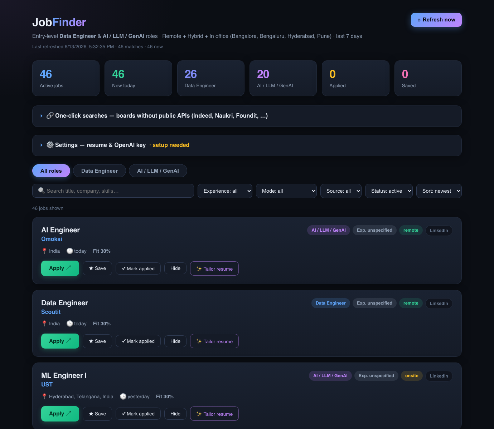

# JobFinder

A personal job portal that fetches **remote, hybrid, and in-office** jobs from
11+ boards, filters them to the roles / experience level / location *you*
choose, refreshes daily, and shows everything in a dashboard with apply links,
detected skills, and an optional OpenAI-powered resume tailoring tool.

Out of the box it's tuned for **entry-level Data Engineer & AI/LLM/GenAI roles
hiring in India**, but everything is customizable in one config file — see
[Customizing your search](#customizing-your-search).



## Quick start

You only need [Docker](https://docs.docker.com/get-docker/) installed.

```sh
git clone https://github.com/k-Rohit/JobFinder.git
cd JobFinder
docker compose up -d --build
```

Open **http://localhost:8787** — the first batch of jobs appears within a
minute. That's it. Optionally:

- **Tailor your resume to a job** → open ⚙️ Settings, upload your resume and
  paste an OpenAI API key, then click "✨ Tailor resume" on any job.
- **Pull Indeed + Naukri results** → add a free JSearch (RapidAPI) key in ⚙️ Settings.
- **Search different roles / country / cities** → see
  [Customizing your search](#customizing-your-search).

## Start the portal

### Option A — Docker (recommended)

```sh
docker compose up -d --build
```

Then open **http://localhost:8787**. The jobs database and your uploaded
resume persist in the `jobfinder-data` Docker volume across restarts.

Stop / restart / view logs:

```sh
docker compose down       # stop
docker compose up -d       # start again
docker compose logs -f     # follow logs
```

To preload API keys instead of using the dashboard ⚙️ Settings, create a
`.env` file next to `docker-compose.yml`:

```sh
OPENAI_API_KEY=sk-...
JSEARCH_API_KEY=...
OPENAI_MODEL=gpt-4o-mini
```

### Option B — run locally without Docker

```sh
./run.sh
```

To have it start automatically at login (so the daily refresh always runs):

```sh
cp com.jobfinder.portal.plist ~/Library/LaunchAgents/
launchctl load ~/Library/LaunchAgents/com.jobfinder.portal.plist
```

## Customizing your search

All profile settings live in one file. Copy the example and edit it:

```sh
cp config.example.json config.json   # then edit config.json
```

With Docker, put `config.json` inside the data volume so the container reads it:

```sh
docker compose cp config.json jobfinder:/data/config.json
docker compose restart
```

(Or set `JOBFINDER_CONFIG=/path/to/config.json`.) Key options:

| Key | What it controls | Default |
|---|---|---|
| `roles` | Job roles to match: each has a `label`, `title_keywords` (decide if a title matches) and `search_terms` (sent to board search APIs) | Data Engineer, AI/LLM/GenAI |
| `comfortable_years` / `max_experience_years` | Experience window. Jobs asking more than the max are dropped; between comfortable and max are flagged "stretch" | 1 / 3 |
| `onsite_cities` | Cities where hybrid/in-office jobs are kept (remote is global) | Bangalore, Hyderabad, Pune |
| `country` + `require_local_eligibility` | Remote jobs must be open to this country; postings restricted elsewhere are dropped | India, true |
| `max_age_days` | Only show postings newer than this | 7 |
| `favorite_companies` | Companies tracked in the **⭐ Fav. companies** tab — fetched from their ATS board (Lever/Greenhouse) where available plus a company-targeted LinkedIn search | Meesho, Swiggy, Zomato, Blinkit, Zepto, Myntra, Urban Company |

The **⭐ Fav. companies** tab tracks specific employers' DE/AI openings (using
a broader role vocabulary — Data Scientist, Applied Scientist, SDE-Data, etc.
— and showing senior roles too, since it's a company tracker). These bypass the
freshness and onsite-city limits. Each company also gets a one-click careers
link. Add a company with `{"name": "...", "match": ["..."], "lever": "token"}`
(or `"greenhouse": "token"`).

Changing `roles`, `country`, and `onsite_cities` automatically retargets the
filters **and** the LinkedIn / JSearch / The Muse search queries. Set
`require_local_eligibility` to `false` to keep all remote jobs regardless of
region.

## What it does

- **Fetches from 11 sources** (no keys needed):
  RemoteOK, We Work Remotely, Remotive, Jobicy, Arbeitnow, Himalayas,
  The Muse, Working Nomads, Jobspresso, NoDesk, and **LinkedIn** (via its
  public guest job-search endpoint, politely throttled).
- **Indeed / Glassdoor**: blocked behind Cloudflare, so direct fetching isn't
  possible — add a free **JSearch (RapidAPI) key** in ⚙️ Settings to pull
  their listings via Google-for-Jobs, or use the one-click search links.
- **Location policy**: every job must be open to candidates in India.
  Remote roles restricted to other regions (USA-only, Europe-only, …) are
  dropped; hybrid/in-office roles are kept only for **Bangalore, Hyderabad
  and Pune**. The Mode filter has a **Remote · India only** option, and
  remote jobs explicitly open to India get a 🇮🇳 badge.
- **Filters for you**: only Data Engineer / AI / LLM / GenAI / ML titles;
  drops Senior/Staff/Lead/Manager roles and anything asking 4+ years.
  Experience tags: `Entry/Fresher`, `≤ 1 yr`, `Unspecified`, `Stretch (2–3 yrs)`.
- **Skill extraction**: ~45 skills (Python, SQL, Spark, Airflow, dbt, AWS,
  LangChain, RAG, vector DBs, …) detected per posting and shown as tags.
- **Fit score** (0–100) ranks how suitable each job is for a fresher.
- **Daily auto-refresh** while the server runs, plus a "Refresh now" button.
- **Track your pipeline**: Save / Mark applied / Hide on every job, with stats.
- **Resume tailoring**: upload your resume (PDF/DOCX/TXT/MD) and add your
  OpenAI API key in ⚙️ Settings, then click "✨ Tailor resume" on any job.
  GPT rewrites your resume with that job's ATS keywords (never inventing
  experience) and you download the result as `.docx` or `.md`.

## Configuration

| Setting | How |
|---|---|
| OpenAI API key | ⚙️ Settings on the dashboard, or `export OPENAI_API_KEY=…` |
| OpenAI model | `export OPENAI_MODEL=gpt-4o` (default `gpt-4o-mini`) |
| JSearch key (Indeed/Glassdoor) | ⚙️ Settings, or `export JSEARCH_API_KEY=…` |
| Office-job cities | edit `INDIA_HUBS` in `jobfinder/filters.py` |
| Port | edit `run.sh` |

Data lives in `jobs.db` (SQLite) and `data/` (your resume). Only postings
from the **last 7 days** are kept — older ones are rejected at fetch time
and existing ones age out daily (saved/applied jobs are never pruned).
